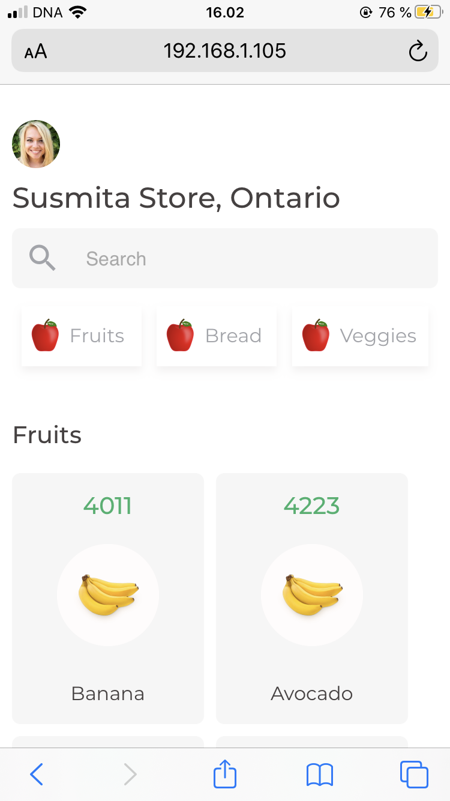
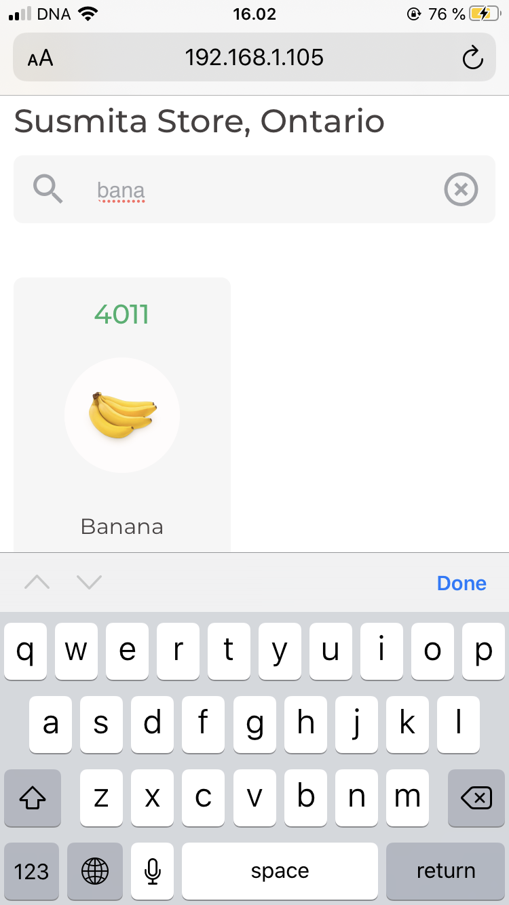
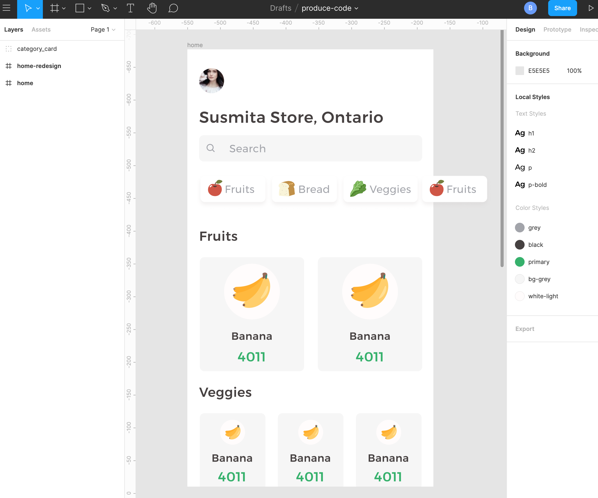
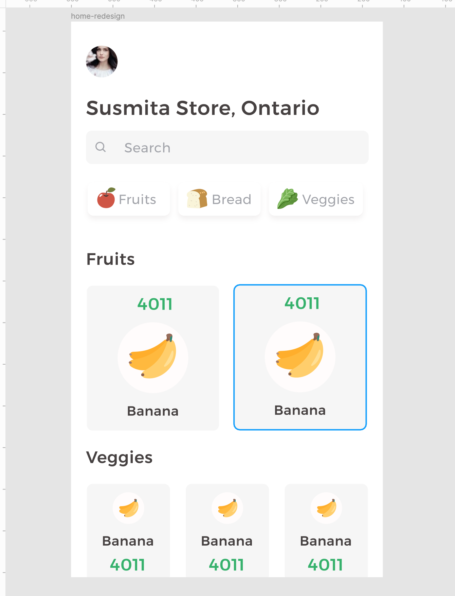

## Grocery PLU codes search 
- [live demo](https://produce-code.netlify.app)

### Story behind the project
- Recently my friend started working as a cashier in one of the Canadian grocery stores. 
- The most challenging part for her was to memorize the PLU codes.
- Her store does not have self weighting system like many Finnish stores.
- To solve her pain I decided to make it an interactive app for her by transferring the paper version to an online version. 
- I am not sure if she is allowed to look at her phone but I wanted to do it anyway :) 

## First version features 
- Items list
- Search items
- Display name and code

### Design
- The only goal for this app is to see the PLU code as fast as possible.
- I designed a quick mockup using Figma.

- Later I realized PLU code is the most important thing so moved it to the top.

## Design and development time
- First version for testing - 6 hours (26.09.2020)

## Tech stacks
- React
- TypeScript
- SCSS
- CSS/FLEX
- React Hook

## Future goal
### 1. Setup backend 
- Setup backend
- User signup/login
- Add/remove items
- Edit items details
- Add custom photos/icons

### 2. Long-term goal - Implement an image to search option
- app will open the camera
- detects item 
- display PLU code 
- ( It might take a few months to years to implement this feature. ) 
